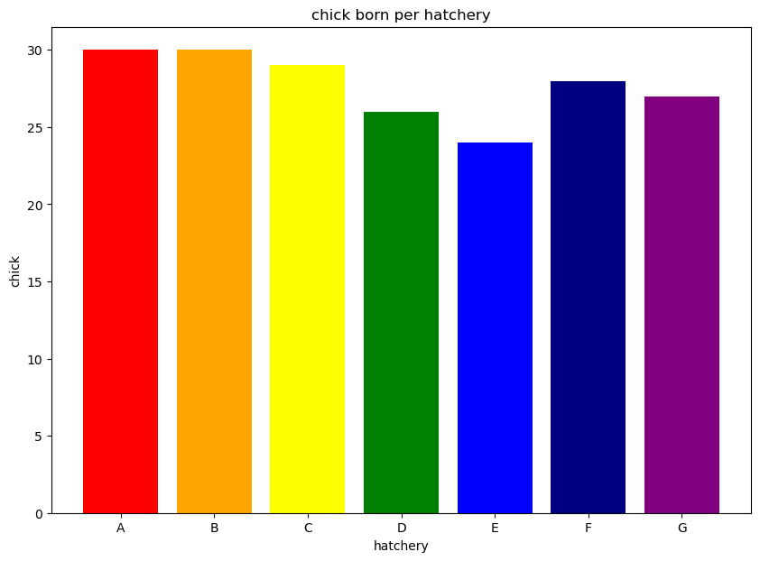

```python
import pandas as pd
b = pd.read_csv('ch4-2.csv')
b.head()
# Import pandas
# Read "ch4-2.csv" file using pandas package
# Show first 5 value of b function
```


<div>
<style scoped>
    .dataframe tbody tr th:only-of-type {
        vertical-align: middle;
    }

    .dataframe tbody tr th {
        vertical-align: top;
    }

    .dataframe thead th {
        text-align: right;
    }
</style>
<table border="1" class="dataframe">
  <thead>
    <tr style="text-align: right;">
      <th></th>
      <th>chick_nm</th>
      <th>weight</th>
    </tr>
  </thead>
  <tbody>
    <tr>
      <th>0</th>
      <td>b01</td>
      <td>37</td>
    </tr>
    <tr>
      <th>1</th>
      <td>b02</td>
      <td>39</td>
    </tr>
    <tr>
      <th>2</th>
      <td>b03</td>
      <td>41</td>
    </tr>
    <tr>
      <th>3</th>
      <td>b04</td>
      <td>45</td>
    </tr>
    <tr>
      <th>4</th>
      <td>b05</td>
      <td>37</td>
    </tr>
  </tbody>
</table>
</div>


```python
b.info()
# Identify b file
```

    <class 'pandas.core.frame.DataFrame'>
    RangeIndex: 30 entries, 0 to 29
    Data columns (total 2 columns):
     #   Column    Non-Null Count  Dtype 
    ---  ------    --------------  ----- 
     0   chick_nm  30 non-null     object
     1   weight    30 non-null     int64 
    dtypes: int64(1), object(1)
    memory usage: 608.0+ bytes


```python
b.describe()
# Show statistical info of b file
```


<div>
<style scoped>
    .dataframe tbody tr th:only-of-type {
        vertical-align: middle;
    }

    .dataframe tbody tr th {
        vertical-align: top;
    }

    .dataframe thead th {
        text-align: right;
    }
</style>
<table border="1" class="dataframe">
  <thead>
    <tr style="text-align: right;">
      <th></th>
      <th>weight</th>
    </tr>
  </thead>
  <tbody>
    <tr>
      <th>count</th>
      <td>30.000000</td>
    </tr>
    <tr>
      <th>mean</th>
      <td>38.400000</td>
    </tr>
    <tr>
      <th>std</th>
      <td>3.286335</td>
    </tr>
    <tr>
      <th>min</th>
      <td>31.000000</td>
    </tr>
    <tr>
      <th>25%</th>
      <td>36.250000</td>
    </tr>
    <tr>
      <th>50%</th>
      <td>39.000000</td>
    </tr>
    <tr>
      <th>75%</th>
      <td>40.750000</td>
    </tr>
    <tr>
      <th>max</th>
      <td>45.000000</td>
    </tr>
  </tbody>
</table>
</div>


```python
import matplotlib.pyplot as plt
# Import matplot package
plt.figure(figsize=(10,7))
# Set figure size to (10w, 7h)
plt.hist(b.weight,bins=7)
# Plotting with 7 different block figure
plt.title('B hatchery chick weight distribution' ,fontsize=17)
# Assign the title
plt.xlabel('chick weight (g)')
# Assign the x-axis title
plt.ylabel('number of chick')
# Assign the y- axis title
plt.show()
```


    

    


```python
plt.figure(figsize=(8, 10))
# Setting the figure size to (8w, 10h)
plt.boxplot(b.weight)
# Plotting boxplot
plt.title('B hatchery chick weight boxplot', fontsize=17)
# Assigning graph title
plt.ylabel('chick weight(g)')
# Assigning y-axis label
plt.show()

# Boxplot is also a great alternative to see the distribution.
# The red line indicates 50th percentile also known as median
# The upper end of the box indicates 75th percentile and lower end indicates 25th percentile
# The end bar is indicating the observed max/min value
```


    

    


```python
plt.figure(figsize=(10,12))
# Setting the figure size to (10w,12h)
plt.subplot(2,1,1)
# Subplot provide a way to plot multiple plot at once.
plt.hist(b.weight, bins=7)
# Plotting histogram with 7 block figure.
plt.title('B hatchery chick weight distribution', fontsize=17)
# Assigning the graph title
plt.subplot(2,1,2)
# Subplot provide a way to plot multiple plot at once.
plt.boxplot(b.weight, vert=False)
# Plotting the boxplot in horizontal
# This is coded to shown horizontally because subplot(2,1,2) is scripted for two horizontal graph.
# In case 2 vertical graph is wanted, subplot (1,2,1) and (1,2,2) is suitable
# In case 4 graph is needed, (2,2,1) (2,2,2) (2,2,3) (2,2,4) could be used respectively.
plt.show()
```


    

    


```python
# Now, lets see the comparison between the theoretical value and the calculated value.
from tabulate import tabulate
table = [['Value', 'Minimum', '25th percentile', '75 percentile', 'Maximum'], 
         ['Theoretical', 31.00, 36.25, 40.75, 45.00],
         ['Calculated', 28.53, 36.18,40.62, 48.26 ], 
         ['Equation', 'Mean-3s', 'Mean -0.675s', 'Mean+0.6745s', 'Mean+3s']]
print(tabulate(table))
```

    -----------  -------  ---------------  -------------  -------
    Value        Minimum  25th percentile  75 percentile  Maximum
    Theoretical  31.0     36.25            40.75          45.0
    Calculated   28.53    36.18            40.62          48.26
    Equation     Mean-3s  Mean -0.675s     Mean+0.6745s   Mean+3s
    -----------  -------  ---------------  -------------  -------


```python
# As you can see, the value somewhat differ but falls in a reasonable range. 
```
