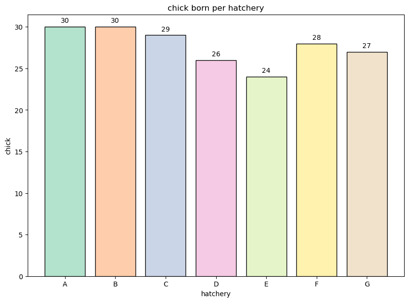

```python
import pandas as pd
# Import pandas package as pd
w = pd.read_csv('ch5-1.csv')
# Read 'ch5-1' csv file
w.head()
# Show the first 5 data of 'ch5-1' file
```


<div>
<style scoped>
    .dataframe tbody tr th:only-of-type {
        vertical-align: middle;
    }

    .dataframe tbody tr th {
        vertical-align: top;
    }

    .dataframe thead th {
        text-align: right;
    }
</style>
<table border="1" class="dataframe">
  <thead>
    <tr style="text-align: right;">
      <th></th>
      <th>chick_nm</th>
      <th>weight</th>
      <th>egg_weight</th>
      <th>movement</th>
      <th>food</th>
    </tr>
  </thead>
  <tbody>
    <tr>
      <th>0</th>
      <td>a01</td>
      <td>140</td>
      <td>65</td>
      <td>146</td>
      <td>14</td>
    </tr>
    <tr>
      <th>1</th>
      <td>a02</td>
      <td>128</td>
      <td>62</td>
      <td>153</td>
      <td>12</td>
    </tr>
    <tr>
      <th>2</th>
      <td>a03</td>
      <td>140</td>
      <td>65</td>
      <td>118</td>
      <td>13</td>
    </tr>
    <tr>
      <th>3</th>
      <td>a04</td>
      <td>135</td>
      <td>65</td>
      <td>157</td>
      <td>13</td>
    </tr>
    <tr>
      <th>4</th>
      <td>a05</td>
      <td>145</td>
      <td>69</td>
      <td>157</td>
      <td>13</td>
    </tr>
  </tbody>
</table>
</div>


```python
w.info()
# Show properties of w function
```

    <class 'pandas.core.frame.DataFrame'>
    RangeIndex: 30 entries, 0 to 29
    Data columns (total 5 columns):
     #   Column      Non-Null Count  Dtype 
    ---  ------      --------------  ----- 
     0   chick_nm    30 non-null     object
     1   weight      30 non-null     int64 
     2   egg_weight  30 non-null     int64 
     3   movement    30 non-null     int64 
     4   food        30 non-null     int64 
    dtypes: int64(4), object(1)
    memory usage: 1.3+ KB


```python
# This time, I will be doing correlation analysis.
# When opperating coreelation analysis, there must be filled only with int
# Therefore, I need another form of data set that only contains int. (Erase first column)
w_n=w.iloc[:,1:5]
w_n.head()
# Check to see if there are no more str
```


<div>
<style scoped>
    .dataframe tbody tr th:only-of-type {
        vertical-align: middle;
    }

    .dataframe tbody tr th {
        vertical-align: top;
    }

    .dataframe thead th {
        text-align: right;
    }
</style>
<table border="1" class="dataframe">
  <thead>
    <tr style="text-align: right;">
      <th></th>
      <th>weight</th>
      <th>egg_weight</th>
      <th>movement</th>
      <th>food</th>
    </tr>
  </thead>
  <tbody>
    <tr>
      <th>0</th>
      <td>140</td>
      <td>65</td>
      <td>146</td>
      <td>14</td>
    </tr>
    <tr>
      <th>1</th>
      <td>128</td>
      <td>62</td>
      <td>153</td>
      <td>12</td>
    </tr>
    <tr>
      <th>2</th>
      <td>140</td>
      <td>65</td>
      <td>118</td>
      <td>13</td>
    </tr>
    <tr>
      <th>3</th>
      <td>135</td>
      <td>65</td>
      <td>157</td>
      <td>13</td>
    </tr>
    <tr>
      <th>4</th>
      <td>145</td>
      <td>69</td>
      <td>157</td>
      <td>13</td>
    </tr>
  </tbody>
</table>
</div>


```python
w_cor=w_n.corr(method='pearson')
w_cor
```


<div>
<style scoped>
    .dataframe tbody tr th:only-of-type {
        vertical-align: middle;
    }

    .dataframe tbody tr th {
        vertical-align: top;
    }

    .dataframe thead th {
        text-align: right;
    }
</style>
<table border="1" class="dataframe">
  <thead>
    <tr style="text-align: right;">
      <th></th>
      <th>weight</th>
      <th>egg_weight</th>
      <th>movement</th>
      <th>food</th>
    </tr>
  </thead>
  <tbody>
    <tr>
      <th>weight</th>
      <td>1.000000</td>
      <td>0.957169</td>
      <td>0.380719</td>
      <td>0.877574</td>
    </tr>
    <tr>
      <th>egg_weight</th>
      <td>0.957169</td>
      <td>1.000000</td>
      <td>0.428246</td>
      <td>0.808147</td>
    </tr>
    <tr>
      <th>movement</th>
      <td>0.380719</td>
      <td>0.428246</td>
      <td>1.000000</td>
      <td>0.319011</td>
    </tr>
    <tr>
      <th>food</th>
      <td>0.877574</td>
      <td>0.808147</td>
      <td>0.319011</td>
      <td>1.000000</td>
    </tr>
  </tbody>
</table>
</div>


```python
# Correlation means how do they interact?
# The correlation between weight vs egg_weight has 0.957169.
# This tells us that weight are highly related to egg_weight
# The correlation between weight vs movement has 0.380719
# This tells us that weight is not related to movement.
```


```python
import matplotlib.pyplot as plt
import seaborn as sns
sns.pairplot(w_n)

# Importing packages for correlation graph visualization
```


    <seaborn.axisgrid.PairGrid at 0x7fe363055790>


```python
plt.figure(figsize=(10,6))
sns.heatmap(w_cor,annot=True, cmap = 'Blues')
plt.show()

# Plotting the correlation using the heatmap. 
# "annot = True" is showing the correlation parameter.
# "cmap= 'Blues'" is assigning the color. 
```


    

    


    

    


```python

```


```python

```


```python

```
